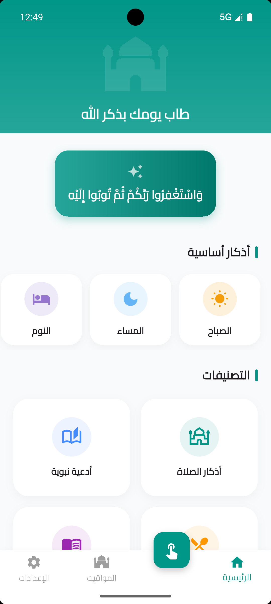
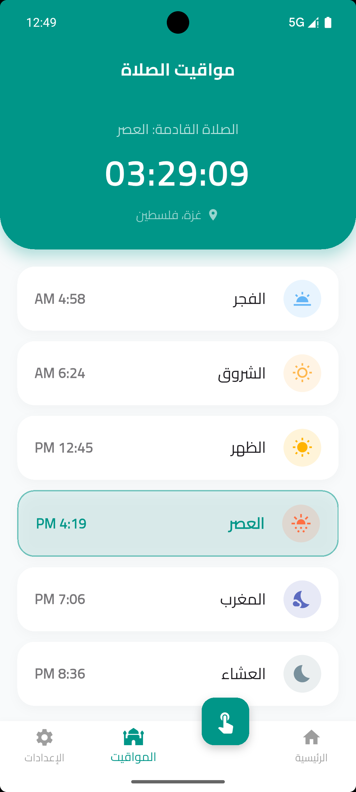
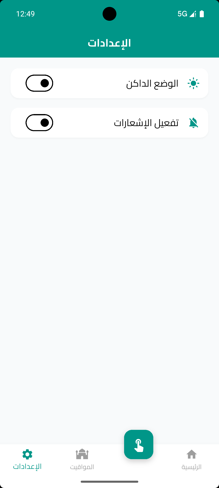
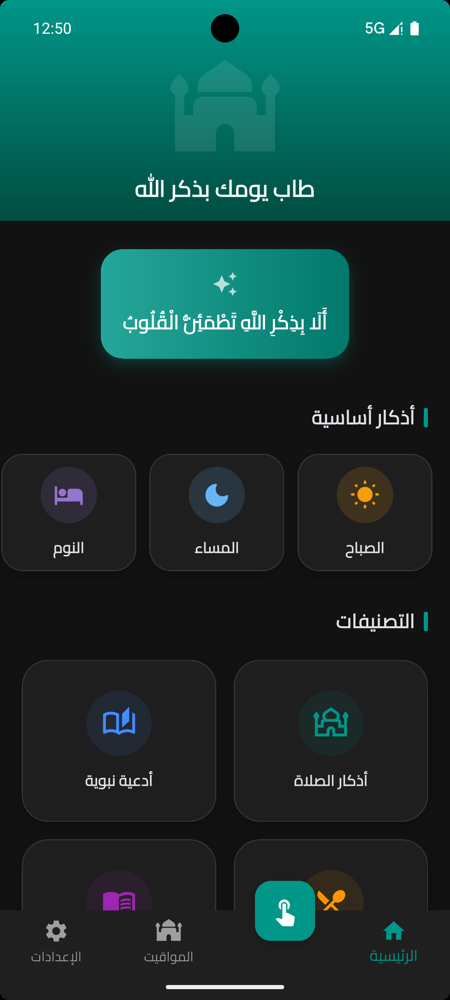
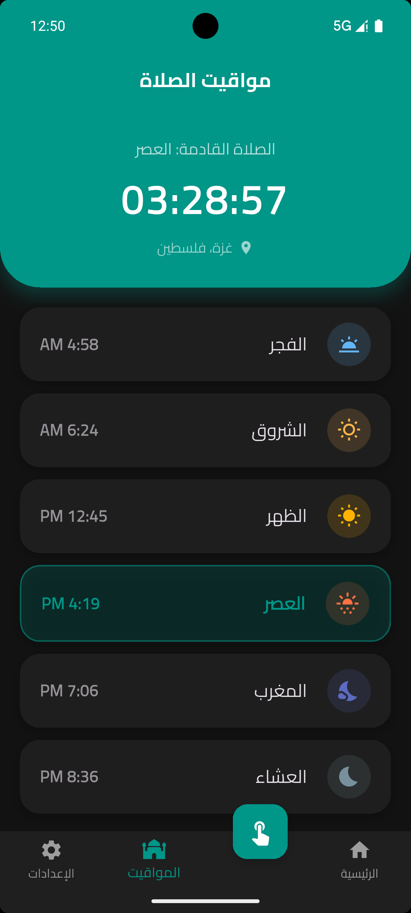
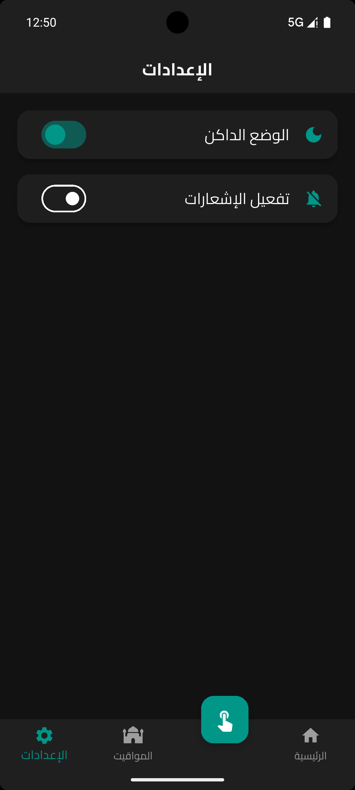

# Azkar App | تطبيق الأذكار والمواقيت 🌙

تطبيق إسلامي متكامل مبني باستخدام **Flutter**، يجمع بين الأذكار اليومية وحساب مواقيت الصلاة بدقة عالية، مع دعم كامل للوضع الداكن والفاتح ونظام تنبيهات ذكي.

---

## 🚀 الميزات الرئيسية (Key Features)

* **مواقيت الصلاة الدقيقة:** حساب المواقيت باستخدام مكتبة `adhan` وفقاً لـ **الهيئة العامة المصرية للمساحة**.
* **نظام الأذكار:** عرض الأذكار مصنفة (صباح، مساء، نوم، إلخ) مع عداد تفاعلي لكل ذكر.
* **التنبيهات الذكية:** إشعارات محلية لتذكير المستخدم بالأذكار اليومية باستخدام `flutter_local_notifications`.
* **دعم الثيمات (Theming):** دعم كامل للـ **Dark Mode** و **Light Mode** لراحة العين.
* **تحديد الموقع:** جلب مواقيت الصلاة آلياً بناءً على إحداثيات الموقع (GPS).
* **إدارة الحالة:** الاعتماد على **BLoC/Cubit** لضمان فصل المنطق عن الواجهات وسلاسة الأداء.

---

## 📸 لقطات من التطبيق (Screenshots)

### ⚪ الوضع الفاتح (Light Mode)
| الشاشة الرئيسية | مواقيت الصلاة | الإعدادات |
| :---: | :---: | :---: |
|  |  |  |

### ⚫ الوضع الداكن (Dark Mode)
| الشاشة الرئيسية | مواقيت الصلاة | الإعدادات |
| :---: | :---: | :---: |
|  |  |  |

---

## 🛠 القرارات التقنية (Technical Decisions)

* **Clean Architecture:** تم تقسيم المشروع إلى طبقات (Data, Domain, Presentation) لسهولة الصيانة.
* **State Management:** استخدام `Cubit` لإدارة الحالات بشكل خفيف وسريع.
* **Data Handling:** معالجة البيانات محلياً من ملفات JSON لضمان سرعة الاستجابة بدون إنترنت.
* **Fonts:** استخدام `google_fonts` لتقديم تجربة بصرية مريحة باللغة العربية.

---

## 📂 هيكلية المشروع (Project Structure)

```text
lib/
├── business_logic/     # Cubits (Prayer, Zikir, Category)
├── data/               # Models & Repositories
├── presentation/       # Screens & Shared Widgets
├── services/           # Notifications, Location & Timezone
├── constants/          # App Themes & Colors
└── main.dart
